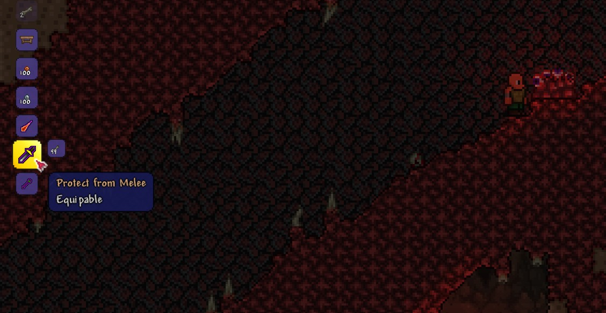
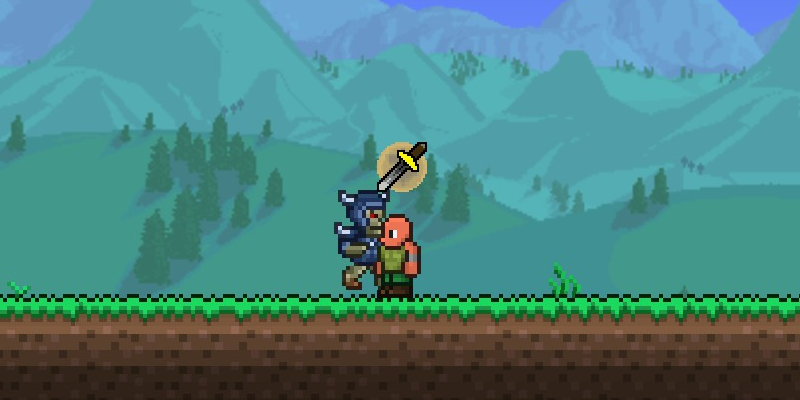
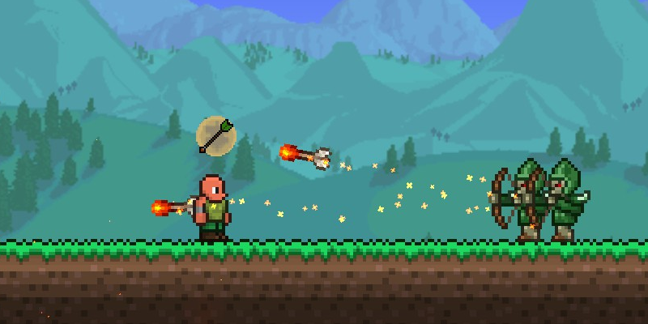
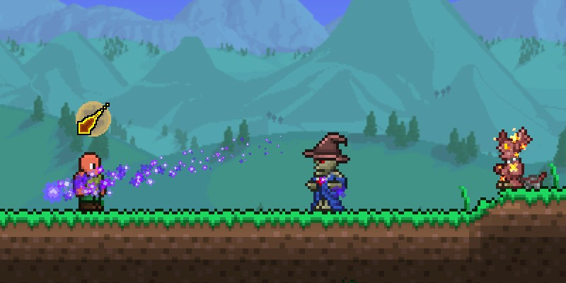

# Protection Prayers

## What is this?

A small tModLoader Terraria mod to add the overhead protection prayers from RuneScape to the game as accessories.

Each one is crafted with 99 bones at a demon altar, and protects from attacks of the corresponding type.

Note that this mod is not meant to be balanced, it's just for fun.

## Screenshots

### Crafting the items

### Protect from Melee

### Protect from Missiles

### Protect from Magic

